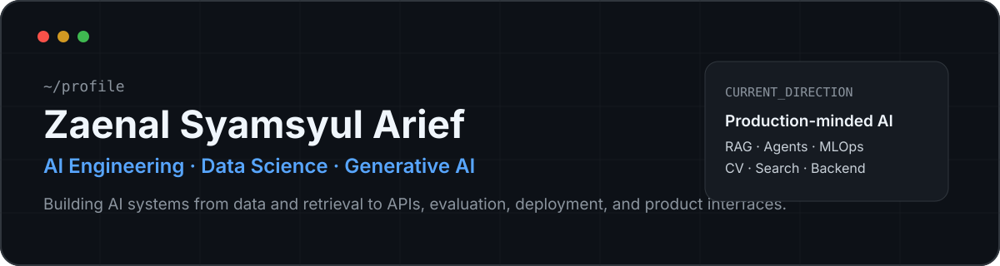

<div align="center">
  
</div>

<br />

<div align="center">
  <a href="https://zaenalsyamsyularief-porto.vercel.app"><b>Portfolio</b></a>
  &nbsp;&nbsp;·&nbsp;&nbsp;
  <a href="https://www.linkedin.com/in/zaenal-syamsyul-arief/"><b>LinkedIn</b></a>
  &nbsp;&nbsp;·&nbsp;&nbsp;
  <a href="mailto:zaenaloco@gmail.com"><b>Email</b></a>
</div>

<br />

## About Me

I’m a Computer Science student focused on **Artificial Intelligence** and the engineering behind useful AI products.

My work sits at the intersection of **machine learning, generative AI, retrieval systems, computer vision, data engineering, backend APIs, analytics, and deployment**. I like building beyond isolated notebooks: connecting models with real data, APIs, databases, evaluation, monitoring, and product interfaces.

> **Current direction:** production-minded AI systems, RAG, agents, evaluation, observability, MLOps, and scalable application architecture.

---

## Tech I Work With

<div align="center">
  
</div>

<br />

<table>
  <tr>
    <td width="25%" align="center"><b>AI / ML</b><br/><sub>RAG · LLMs · CV · NLP</sub></td>
    <td width="25%" align="center"><b>Backend</b><br/><sub>FastAPI · Flask · Node.js</sub></td>
    <td width="25%" align="center"><b>Data</b><br/><sub>PostgreSQL · Elasticsearch · Redis</sub></td>
    <td width="25%" align="center"><b>Infra</b><br/><sub>Docker · GitHub Actions · GCP</sub></td>
  </tr>
</table>

---

## Featured Projects

<table>
<tr>
<td width="50%" valign="top">

### StuntLytics

**Child-growth analytics & decision-support workspace** combining regional monitoring, machine-learning screening, evidence exploration, and AI-assisted insights.

`Next.js` `FastAPI` `Elasticsearch` `scikit-learn` `Redis` `Gemini` `Docker`

**What makes it interesting**
- geospatial risk intelligence
- ML screening pipeline
- evidence-grounded AI insights
- analytics and audit trail
- containerized local infrastructure

<a href="https://github.com/zaenalSamsul/StuntLytics-Productiion"><b>Explore repository →</b></a>

</td>
<td width="50%" valign="top">

### Customer Support Agent

**Production-oriented AI support workflow** with agent orchestration, retrieval, guardrails, evaluation, observability, and Human-in-the-Loop escalation.

`LangGraph` `ChromaDB` `Sentence Transformers` `Langfuse` `SQLite`

**What makes it interesting**
- multi-node agent workflow
- prompt-injection protection
- LLM-as-a-judge evaluation
- tracing and ticket persistence
- Telegram escalation

<a href="https://github.com/zaenalSamsul/Customer-Support-Agent-"><b>Explore repository →</b></a>

</td>
</tr>
<tr>
<td width="50%" valign="top">

### MyCare AI

**AI-powered mental-health application** combining generative AI and emotion classification for more contextual interactions.

`React` `Node.js` `Flask` `TensorFlow` `Vertex AI` `Cloud Run`

**Focus areas**
- decoupled AI architecture
- emotion classification
- generative AI integration
- dedicated ML service
- cloud deployment

<a href="https://github.com/zaenalSamsul/MyCareAi"><b>Explore repository →</b></a>

</td>
<td width="50%" valign="top">

### Price Tracker Agent

**Agentic price-monitoring system** that automates product tracking, persistence, scheduled execution, alerting, and dashboard monitoring.

`Python` `Playwright` `MCP` `APScheduler` `SQLite` `Telegram` `Streamlit`

**Focus areas**
- browser automation
- reusable MCP tools
- scheduled workflows
- price-history persistence
- Telegram notifications

<a href="https://github.com/zaenalSamsul/Price-Tracker-Agent"><b>Explore repository →</b></a>

</td>
</tr>
</table>

---

## System Spotlight — StuntLytics

```text
                         ┌─────────────────────┐
                         │    Regional Data    │
                         └──────────┬──────────┘
                                    │
                                    ▼
                         ┌─────────────────────┐
                         │    Elasticsearch    │
                         └──────────┬──────────┘
                                    │
                                    ▼
┌────────────────┐       ┌─────────────────────┐       ┌──────────────────┐
│ Local ML       │◄──────│ FastAPI Evidence    │──────►│ Next.js Workspace│
│ Screening      │       │ API                 │       │ + Analytics UI   │
└────────────────┘       └──────────┬──────────┘       └──────────────────┘
                                    │
                         ┌──────────┴──────────┐
                         ▼                     ▼
                ┌────────────────┐    ┌────────────────┐
                │ Evidence Layer │    │ Gemini Layer   │
                └────────────────┘    └────────────────┘
```

This project best represents the direction I’m pursuing: combining **AI, data engineering, backend systems, analytics, and product development** into one coherent application.

---

## GitHub Activity

<div align="center">
  
</div>

<table>
  <tr>
    <td width="50%" valign="top">
      
    </td>
    <td width="50%" valign="top">
      
    </td>
  </tr>
</table>

<div align="center">
  
</div>

<sub>Metrics are generated automatically with lowlighter/metrics.</sub>

---

## More Projects

<table>
<tr>
<td width="50%" valign="top">

**E-Wallet Sentiment Monitoring**  
Full-stack sentiment-monitoring platform.  
`Next.js` · `Express.js` · `Python` · `PostgreSQL` · `Docker`  
[Repository →](https://github.com/zaenalSamsul/e-wallet-sentiment)

</td>
<td width="50%" valign="top">

**DANA Sentiment Analysis**  
NLP and sentiment analysis for digital-wallet reviews.  
[Repository →](https://github.com/zaenalSamsul/Analisis-Sentimen-Aplikasi-Dana)

</td>
</tr>
<tr>
<td width="50%" valign="top">

**Chest X-Ray Pneumonia & COVID-19**  
Deep-learning medical image classification.  
[Repository →](https://github.com/zaenalSamsul/CHEST-X-RAY_PNEUMONIA_COVID-19)

</td>
<td width="50%" valign="top">

**Stomach Cancer Detection**  
Medical-image deep learning project.  
[Repository →](https://github.com/zaenalSamsul/Stomach-Cancer-Detection)

</td>
</tr>
<tr>
<td width="50%" valign="top">

**Movie Recommendation System**  
Recommendation system project.  
[Repository →](https://github.com/zaenalSamsul/System-Rekomendasi-Film)

</td>
<td width="50%" valign="top">

**Fashion Product ETL Pipeline**  
Data engineering and ETL workflow.  
[Repository →](https://github.com/zaenalSamsul/PipelineETLProdukFashion)

</td>
</tr>
</table>

---

## What I’m Exploring Now

```yaml
focus:
  - production AI applications
  - RAG and agentic workflows
  - evaluation, guardrails and observability
  - MLOps and deployment practices
  - AI + backend + data architecture
  - maintainable AI product systems
```

---

<div align="center">
  <b>Build useful systems. Learn deeply. Ship continuously.</b>
  <br/><br/>
  <a href="https://zaenalsyamsyularief-porto.vercel.app">Portfolio</a>
  &nbsp;·&nbsp;
  <a href="https://www.linkedin.com/in/zaenal-syamsyul-arief/">LinkedIn</a>
  &nbsp;·&nbsp;
  <a href="mailto:zaenaloco@gmail.com">Email</a>
</div>
